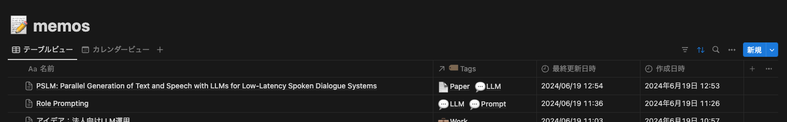

# Notion Enhancer for Google Search

Google 検索ページの検索結果の横に同じクエリでの Notion での検索結果とそのリンクを表示する Chrome 拡張機能です。

## Install

拡張機能インストール後、アイコンを右クリックしオプションを開き、画像の2つの項目を設定してください。

- Notion API Token: Notion API のインテグレーションを作成し、検索したいDBにコネクトを設定したのち Token を設定してください。
- Title Property Name: Notion の各記事のタイトルを格納しているプロパティ名を設定してください。

Title Property Name については、例えば以下のようなDBの場合は `名前` となります。このプロパティの値がリンク文字列として表示されます。

