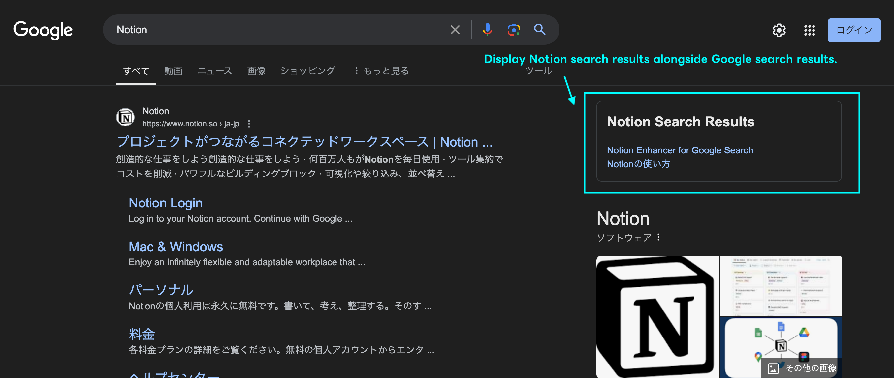
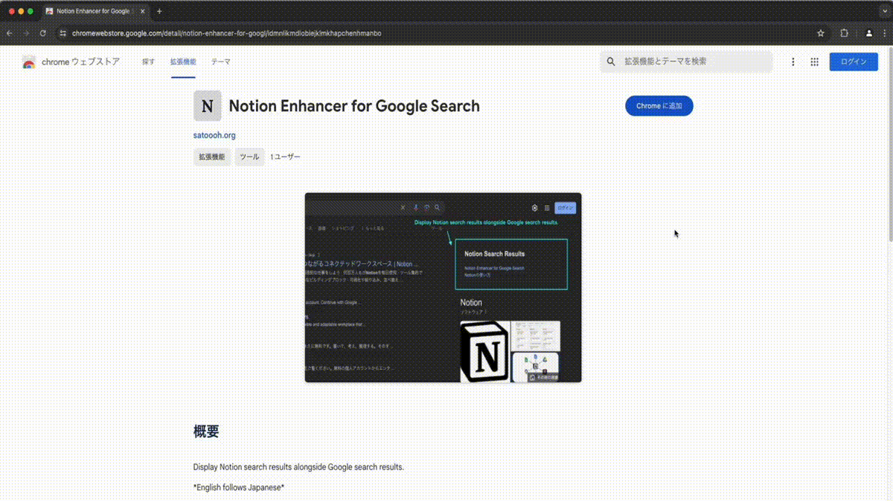
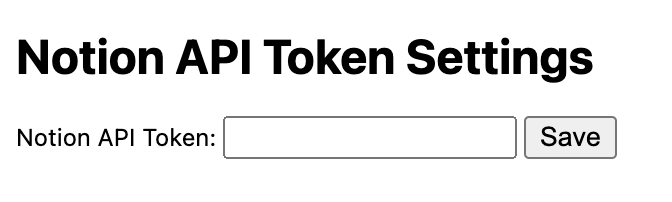

# Notion Enhancer for Google Search

Notion Enhancer for Google Search is a Chrome extension that displays Notion search results alongside Google search results.
This allows you to efficiently view both Google search results and Notion search results together.

日本語版README: [README_JA.md](README_JA.md)

## Install

- After installing the extension, click the icon to open the options and set the Notion API Token.
- To get the Notion API Token, create an integration in Notion API, connect it to the database you want to search, and then set the token.

